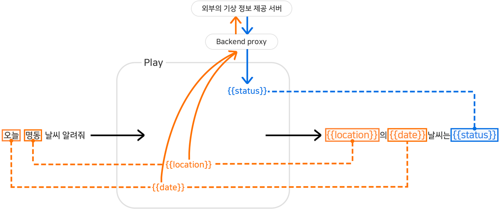
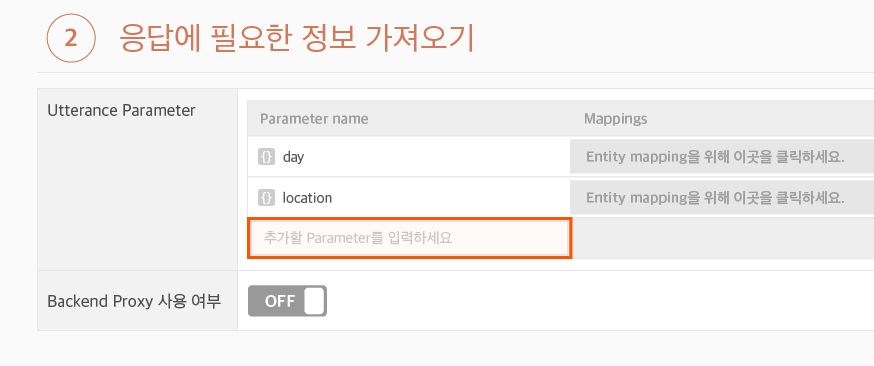
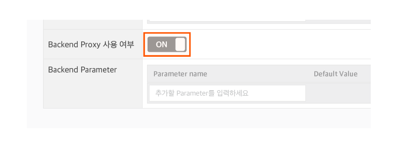
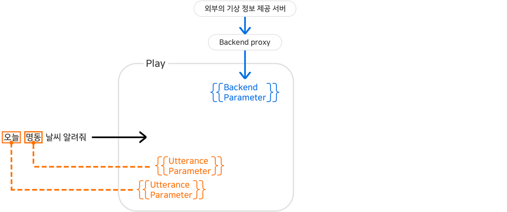

# Parameter

## Parameter 사용하기 

앞서 [아리아, 안녕!](../../hello-aria/)에서 사용자의 발화에 대해 응답하는 아주 간단한 Play를 만들어보았습니다.

이 Play는 사용자의 발화에 대해 똑같은 말만 반복하기 때문에 실제 활용도는 낮습니다. 사용자에게 의미있는 서비스가 되기 위해서는 정보가 필요합니다. 이 정보를 어딘가로부터 가져와서 Play에서 응답을 만들 때 활용하기 위해서는 이 정보들을 담아두는 Parameter라는 것이 필요합니다.

Parameter는 정보를 담아두고 사용하는 일종의 그릇입니다. Play에서 응답을 만들 때 문장 내에 parameter를 입력하면, 해당 Parameter에 담긴 정보\(Entity\)에 따라 Play가 응답합니다.

이러한 Parameter는 정보를 어디서 가져오는가에 따라 Utterance Parameter와 Backend Parameter로 구분됩니다. Utterance Parameter는 사용자의 발화에서 가져온 정보를 담는 Parameter이며, Backend Parameter는 외부 서버 등 사용자의 발화 외의 곳에서 정보를 가져와 담는 Parameter입니다.

## Parameter 만들기 

Parameter의 사용 방법을 알아보기 위해, 다음과 같이 사용자에게 특정 날짜나 특정 장소에 대한 날씨 값을 제공해주는 Play를 만든다고 가정을 해보겠습니다.

여기서, "오늘"과 "명동"이라는 정보는 사용자의 발화\("오늘 명동 날씨 알려줘."\)에서 알 수 있는 정보\(Entity\)입니다.

이렇게 사용자의 발화에서 얻을 수 있는 정보는 Utterance Parameter를 만들어서 이곳에 담기도록 지정을 하여 Play의 응답에 이를 사용할 수 있습니다.

그리고, '흐리다', '맑다'와 같은 기상 정보는 기상청과 같이 외부의 서버를 통해 받아오는 정보입니다. 이러한 정보는 Backend Parameter를 생성하고 이곳에 담기도록 지정을 하면, 이 역시 Play 응답에 사용할 수 있습니다.

### Utterance Parameter 등록하기

[Action 만들고 응답 등록하기](../../hello-aria/create-an-action-and-an-answer.md)에서 만들어 보았던 'answer.weather'라는 Action에서 Parameter를 만드는 법을 설명하도록 하겠습니다.

1. 우선, `User Utterance Model` &gt; `Custom Intents` 페이지에서 다음과 같이 예상 발화를 입력하고 Entity를 지정해줍니다.

     

   * 시간, 날짜 표현은 Built-in Entity Type에서 선택합니다.
   * 동 이름은 Custom Entity Type으로 추가합니다.

2. Play Builder 홈 화면에서 Parameter를 추가할 Play를 클릭하여 선택한 후, `Custom Actions` 버튼을 클릭합니다.
3. Action List에서 'answer.weather'라는 Action을 선택합니다.
4. 응답에 필요한 정보 가져오기 영역의 Utterance Parameter 입력 필드에 Parameter명을 입력하고 `Enter` 키를 누르거나 입력 필드 이외 영역에 마우스 왼쪽 버튼을 클릭합니다.

    

   * 영자, 숫자, 특수문자인 언더바\(`_`\), 하이픈\(`-`\)만 사용하여 40자 이내에서 작성할 수 있으며, Play 내에서 같은 이름을 중복해서 등록할 수 없습니다.
   * 이번 예에서는 '오늘'과 같이 특정일을 담을 Parameter와 '면목동'과 같이 지역을 담을 Parameter를 담을 2개의 Utterance Parameter를 만듭니다.
   * Parameter명을 각각 'day'와 'location'으로 지정합니다.

5. 추가한 Parameter 우측 Mapping 항목의 `Entity mapping을 위해 이곳을 클릭하세요.` 버튼을 클릭한 후 Entity mapping 창에서 'day' Parameter에는 '오늘'이 담겨 있는 'BID\_DT\_DAY'를, 'location' Parameter에는 'LOC\_DONG' Entity Type를 각각 매핑합니다.

   

   * 각 Parameter 우측 Mapping 항목에 매핑된 Entity Type:Entity Role이 표시됩니다.
   * Utterance Parameter 2개가 정의되었으며, 응답에 이 Parameter를 사용할 수 있습니다.

### Backend Parameter 등록하기

Backend Parameter는 Backend proxy을 통해서만 정보값을 채울 수 있는 Parameter입니다.


Backend proxy에 대한 자세한 내용은 [외부 연동 서버\(Backend proxy\)](../../use-backend-proxy/)를 참고하세요.


다음 순서로 Backend Parameter를 설정합니다.

1. Utterance Parameter 아래의 Backend proxy 사용여부 항목의 `OFF` 버튼을 클릭하여 ON\(사용\)으로 설정합니다. Backend Parameter를 정의하는 테이블이 생깁니다.

   

2. Backend Parameter 입력 필드에 Parameter명을 입력하고 `Enter` 키를 누르거나 입력 필드 이외 영역에 마우스 왼쪽 버튼을 클릭합니다.

   

   * 영자, 숫자, 특수문자인 언더바\(`_`\), 하이픈\(`-`\)만 사용하여 40자 이내로 작성할 수 있습니다.
   * Backend Parameter명을 "status"로 지정합니다.

3. Play Builder 우측 상단에 있는 `Play 저장`을 눌러 Play를 저장합니다.

   Play의 Parameter 설정이 완료되면, 이제 Backend proxy에서 이 Parameter에 적절한 값을 전달해 주도록 Backend proxy 동작 환경을 설정해야 합니다.

4. 이렇게 입력을 하고, Backend proxy가 기상 정보를 Backend Parameter에 담아주면 다음과 같은 상태가 됩니다.

   

## Parameter를 사용해 응답 작성하기 

지금까지 Parameter의 개념과 작성\(등록\)하는 방법에 대하여 알아보았습니다. 이제부터는 이와 같이 만들어진 Parameter를 사용하여 Play의 Response\(응답\)을 작성하는 방법을 알아보겠습니다.

1. Play Builder 좌측 메뉴에서 `Actions` &gt; `Custom Actions`를 클릭한 후, `answer.weather` Action을 선택합니다.
2. Output 정의 영역에서 Output 유형은 `Response` 버튼을 선택하고, Prompt 유형은 `대기` 또는 `종료` 버튼을 클릭합니다.

   

   * Prompt 유형에서 '대기'는 Prompt가 스피커를 통해 발화되고 난 후 세션이 끊어지지 않고 유지되는 옵션이며, '종료'는 발화 후 세션이 끊어지는 옵션을 의미합니다.

3. Prompt List의 Prompt 입력창에 중괄호를 연속으로 2번 입력하면 Parameter 자동완성창이 열리며, 위에서 입력했던 "day", "location", "status" 3개의 Parameter가 표시됩니다.

   

4. 키보드 혹은 마우스를 이용하여 'location'을 선택한 후 '의'를 입력한 후, 다시 중괄호 두 개를 눌러 자동완성을 통해 'day'를 선택합니다. 그 후에 "날씨는" 을 입력하고 다시 동일한 방법으로 'status'를 입력합니다. 입력을 완료하면 Prompt 입력창에는 다음과 같이 표시됩니다.

   

5. Play Builder 우측 상단에 있는 `Play 저장` 버튼을 클릭하여 Action 생성을 완료합니다.

   지금까지 작업한 `answer.weather` Action은 다음과 같은 구조를 갖게 되며, Backend proxy가 기상정보를 'status'에 담아서 제공을 할 경우 "여수의 오늘 날씨는 흐립니다"와 같은 답변이 나가게 됩니다.

   


이 장과 함께 보면 좋은 도움말

* [Prompt의 유형](../use-responses/use-prompts.md#prompt-types)


